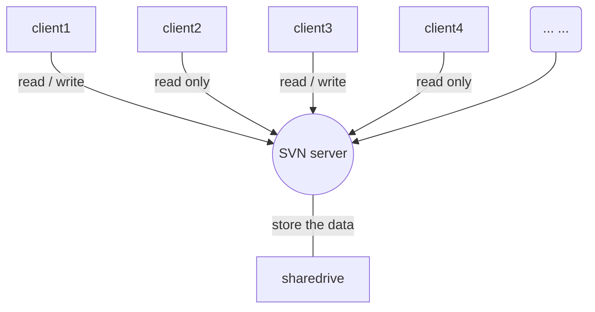

# Markdown 语法

[TOC]

## 斜体和粗体 {#fontformat}
    *abc* / _abc_ //斜体
    **abc**       //粗体
    ***abc***     //加粗斜体
    ~~abc~~       //删除线

## 分级标题 {#title}
    # 一级标题
    ## 二级标题
    ### 三级标题
    #### 四级标题
    ##### 五级标题
    ###### 六级标题

## 超链接 {#link}
行内链接：[]里写链接文字，()里写链接地址, ()中的“”中可以为链接指定title属性，title属性可加可不加。title属性的效果是鼠标悬停在链接上会出现指定的 title文字。[链接文字](链接地址 “链接标题”)’这样的形式。链接地址与链接标题前有一个空格。

    [demo](http://example.com "demo") //行内链接

参考链接：参考式链接分为两部分，文中的写法 [链接文字][链接标记]，在文本的任意位置添加[链接标记]:链接地址 “链接标题”，链接地址与链接标题前有一个空格。
如果链接文字本身可以做为链接标记，你也可以写成[链接文字][] 
[链接文字]：链接地址的形式，见代码的最后一行。

    [google][1], [baidu][2]

    [1]:http//www.google.com "Google"
    [2]:http//www.baidu.com "Baidu"

自动链接: 处理网址和电子邮件信箱，只要是用<>包起来.
    
    <http://example.com>
    <address@example.com>

## 锚点 {#point}
锚点其实就是页内超链接，也就是链接本文档内部的某些元素，实现当前页面中的跳转。
在你准备跳转到的指定标题后插入锚点{#标记}，然后在文档的其它地方写上连接到锚点的链接。

## 列表 {#list}
### 无序列表
使用 *，+，- 表示无序列表。
### 有序列表
有序列表则使用数字接着一个英文句点。
### 自定义型列表
语法说明：
定义型列表由名词和解释组成。一行写上定义，紧跟一行写上解释。解释的写法:紧跟一个缩进(Tab)
for example as below, 

    md
    :   good

    code
    :   yes

### 列表缩进
语法说明：
列表项目标记通常是放在最左边，但是其实也可以缩进，最多 3 个空格，项目标记后面则一定要接着至少一个空格或制表符。

### 包含引用的列表
语法说明：
如果要在列表项目内放进引用，那 > 就需要缩进：

## 引用
语法说明：
引用需要在被引用的文本前加上>符号。

### 引用的多层嵌套
区块引用可以嵌套（例如：引用内的引用），只要根据层次加上不同数量的 > .

### 引用其它要素
引用的区块内也可以使用其他的 Markdown 语法，包括标题、列表、代码区块等.

## 插入图像
图片的创建方式与超链接相似，而且和超链接一样也有两种写法，行内式和参考式写法。
### 行内式
语法中图片Alt的意思是如果图片因为某些原因不能显示，就用定义的图片Alt文字来代替图片。 图片Title则和链接中的Title一样，表示鼠标悬停与图片上时出现的文字。 Alt 和 Title 都不是必须的，可以省略，但建议写上。
语法说明：
    
### 参考式
语法说明：
    在文档要插入图片的地方写![图片Alt][标记]
    在文档的最后写上[标记]:图片地址 “Title”

## 内容目录
在段落中填写 [TOC] 以显示全文内容的目录结构。
效果参见最上方的目录

## 注脚
语法说明：
在需要添加注脚的文字后加上脚注名字 [^注脚名字] ,称为加注。 然后在文本的任意位置(一般在最后)添加脚注，脚注前必须有对应的脚注名字。
注意：经测试注脚与注脚之间必须空一行，不然会失效。成功后会发现，即使你没有把注脚写在文末，经Markdown转换后，也会自动归类到文章的最后。

## LaTeX 公式
### $ 表示行内公式

    $E=MC^2$
Display：    
$E = mc^2$

### $$ 表示整行公式


## 流程图 {#flowchart}
### 流程图的语法大体分为两段，
* 第一段用来定义元素，
* 第二段用来连接元素 
#### 定义元素阶段的语法 
    tag=>type: content:>url 
    //tag就是一个标签，在第二段连接元素时用 
    //type是这个标签的类型，从上段内容看有6中类型，非别为：
#### content就是在框框中要写的内容
中英文均可，但有一点需要特别注意，就是type后的冒号与文本之间一定要有个空格，没空格会出问题。url就是一个连接，与框框中的文本相绑定.
    start 
    end 
    operation 
    subroutine 
    condition 
    inputoutput

#### 连接元素阶段的语法
简单多了，直接用->来连接两个元素，需要注意的是condition类型，因为他有yes和no两个分支，所以要写成这样的格式。 

    c2(yes)->io->e 
    c2(no)->op2->e

```flow
st=>start: start
e=>end: end
op0=>operation: customer
op1=>operation: financial account
op2=>operation: Invoices
op3=>operation: agreement
cond=>condition: sub-children?

st->op0->op1->cond

cond(yes)->op2->e
cond(no)->op3
```



## 表格
语法说明：
不管是哪种方式，第一行为表头，第二行分隔表头和主体部分，第三行开始每一行为一个表格行。
列于列之间用管道符|隔开。原生方式的表格每一行的两边也要有管道符。
第二行还可以为不同的列指定对齐方向。默认为左对齐，在-右边加上:就右对齐。

## 分隔线
可以在一行中用三个以上的星号、减号、底线来建立一个分隔线，行内不能有其他东西。
也可以在星号或是减号中间插入空格。

    * * *
    ***
    *****
    - - -
    --------------------

## 代码
对于程序员来说这个功能是必不可少的，插入程序代码的方式有两种，一种是利用缩进(Tab), 另一种是利用”`”符号（一般在ESC键下方）包裹代码。

语法说明：
插入行内代码，即插入一个单词或者一句代码的情况，使用\`code\`这样的形式插入。
插入多行代码，可以使用缩进或者" \` code \`"　。
注意： 缩进式插入前方必须有空行 

###　行内式　　
" \` code \`"

### 缩进式多行代码
缩进 4 个空格或是 1 个制表符。
一个代码区块会一直持续到没有缩进的那一行（或是文件结尾）。

### 用六个 \` 包裹多行代码

### HTML 原始码
在代码区块里面， & 、 < 和 > 会自动转成 HTML 实体，这样的方式让你非常容易使用 Markdown 插入范例用的 HTML 原始码，只需要复制贴上

